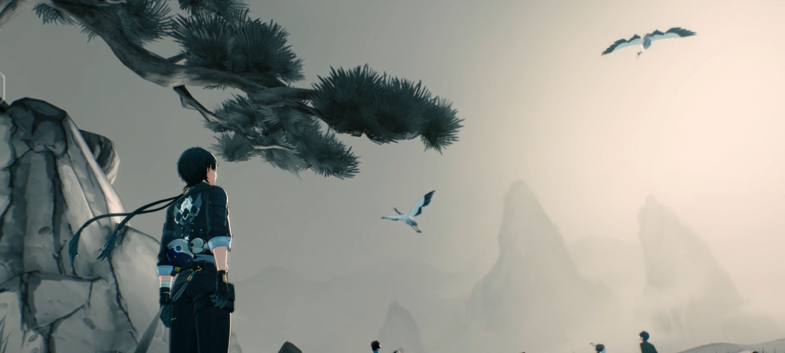
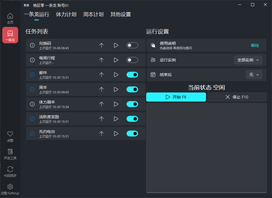

<!-- markdownlint-restore -->

# WutheringWaves - OneDragon

**鸣潮 - 一条龙**

 
使用绝区零一条龙项目框架

自学习实践抄 __图像识别 & 自动化__ 的大作业

如果喜欢本项目，可右上角送作者一个`Star` ✨

 
<!-- markdownlint-restore -->

## 支持功能

- **自动战斗：** 使用第三方项目ok-ww的自动战斗
- **日常清理：** 每日活跃度领取、领邮箱、先约电台、模拟领域、凝素领域、讨伐强敌、周本等全日常清理
- **更多功能：** 定时启动、多账号切换

## 后续计划添加功能

- **打矿，采集植物** 
- **发企业微信完成信息** 
- **选择副本等级** 
- **找几个离传送点近的怪物，打死获得声骇。**

## 图片展示

## 快速开始

使用虚拟环境，依赖文件是requirements-prod.txt。

需要先下载ok-ww项目文件放到3rdparty文件夹里，下载已打包的可执行文件

## 免责声明

- 本项目仅供学习交流使用。

- 开发者团队拥有本项目的最终解释权。

- 使用本项目产生的所有问题与本项目与及开发者团队无关。

- 若您遇到商家使用本软件进行代练并收费，产生的任何问题及后果与本软件无关。

## 贡献/参与者

感谢所有参与到开发的朋友们~

## 赞助

如果喜欢本项目，可以为作者的赞助一点服务器维护费用~

感谢

相关项目：https://github.com/ok-oldking/ok-wuthering-waves

https://github.com/DoctorReid/ZenlessZoneZero-OneDragon

